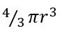

# Instructions  

 The volume of a sphere with a radius of r   

  1. Write the code for a program that asks the user for the _diameter_  of a sphere, then displays the volume of that  sphere 
  ___Note: the input is diameter but the formula requires radius `r` so you will have to convert to radius___
  2. for the value of `pi` use  3.14159 (for now)
  3. For test data calculate the volume you should get given a diameter of 6.65 cm ; choose another value so you have 2x sets of test data.   Feel free to google for a calculator to get the expected result, or diy!  Make sure your code returns the correct expected result.
  5. put the two test data sets  & expected result in your code as a comment
  7. For testing you can use any print you want, once it is working use a format string to display the diameter, radius and volume (optional to limit to 4 decimal places)
## Hints
* For square root  use an exponent of 0.5 ex the expression `9**0.5` results in `3` (try it in the console)
* the measure doesn't matter for the purpose of calculation. We input cm the output is in cm, we input m the out put is in m.  You can put this in your display but it doesn't effect the calculation.
## Reminders 
* __always begin your code with__
  ```python
  # description of the program
  # your name
  # the date
  ```
* __use meaningful variable names__
* __in python we use the following [arithmetic operators](https://greenteapress.com/thinkpython2/html/thinkpython2002.html#sec9)__
  * add  `+`
  * subtract `-`
  * divide `/`
  * multiply `*`
  * exponent `**`
* __reminder input() always returns a string so to do arithmetic we must convert__
  ```
  age  = input("how old is your dog?")
  dogyrs = age * 7    # error!!!
  age = int(age)      # convert string to int  (no decimal point)
  dogyrs = age * 7    # ok!!!
  cost = input('how much is your dog food')
  cost = float(cost)  # convert sting to float (has decimal pont) 
  print("wow", cost, "is a lot")
  ```