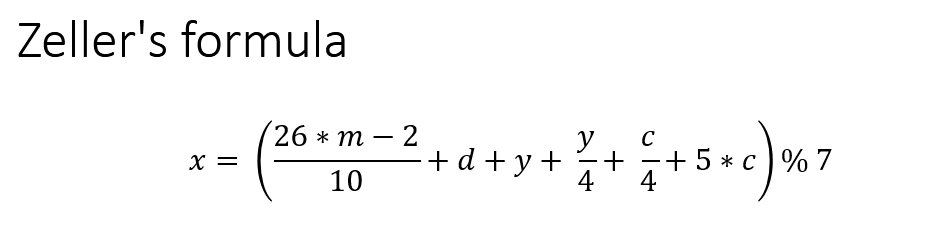
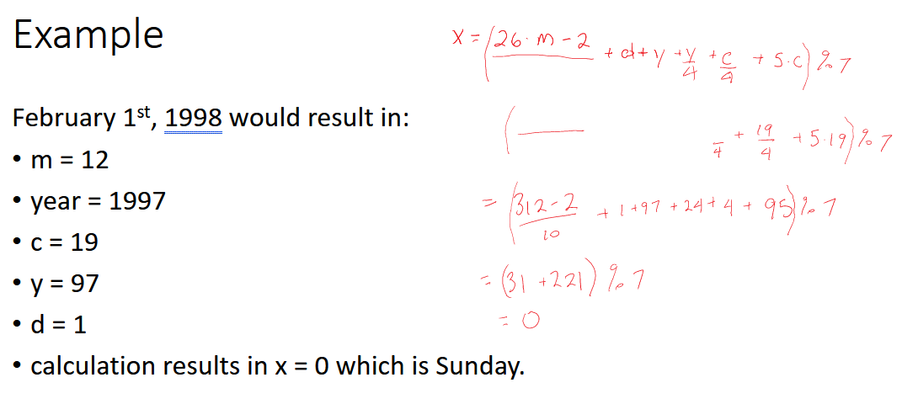

# Instructions  

  **Zeller's congruence algorithm can be used to calculate the day-of-week from any calendar date we will implement this algorithm**

  _You can do this with a partner or solo, it's better to do it with a partner!_
  
  ## Reference
  https://en.wikipedia.org/wiki/Zeller%27s_congruence 
  ## Steps
  1. Write a function `zeller` that takes the year (yyyy), month (mm) and day (dd), calculates and  returns the day number, using zellers formula.  The number is between 0 and 6,  0 is Sunday
  * if month is < 1 or > 12 return `-1`
  * if day is < 1 or > 31 return  `-1`
  * no need to validate the year
  3. Test your function `zeller` 2x valid data sets, you can use the date in the example image and use google to find the day for another date (or use today) plus 1x with the day wrong, 1x with the month wrong (4x total)
  4. Write a second function `day_name` that takes the day number and returns the appropriate string
  5. Test your `day_name` function, use 2x test data sets & results
  6. Finally write a function `main` that takes no parameters, asks the user for the year, month and day, calls the two other functions and displays the day name along with the date in a format string.  If -1 is returned by `zeller` display an error message instead of the date & day.
  
  ### Note:
  You are given function stubs and the call to main in main.py, this is the correct structure for a python program, using single purpose functions.  Put your code statements in the propper place.
  ### Finally add validation, when you get the data
  When steps 1-6 are working, add validation in main. When you read in the month & day force the user to input a correct number, use a separate `while` loop for each.  You can use 1-31 for day or get fancy & check the right range for each month.
  ## Other info
  
  * all divisions are floor divisions
  * y = last two digits of the year
  * c = first two digits of the year
  * m = the adjusted month number
      * calculated as (month number -2), ex January is `-1 from 1-2 ` 
      * if m is < 1 add 12 to m and subtract 1 from the year, before using them in the formula 
       (DO NOT confuse this, you still need the -2 in the formula above)

