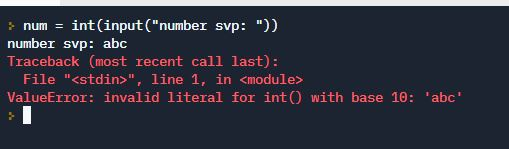

# exception handling - advanced  data validation

  **we have seen errors, for example  if we are expecting a number and the user puts in a letter** 


  
  _we cannot convert letters to a number, so python throws an exception_
  
  _if an exception is thrown and not caught the program crashes, so we want to handle exceptions_
# Exception handling  
```
  try:
    <code to run>
  except <NameOfError>:
    <code to run if exception NameOfError happens
    when we run the code in try>
  else:
    <code to run if there is no exception>
```

# See main.py
for examples with and without exception handling